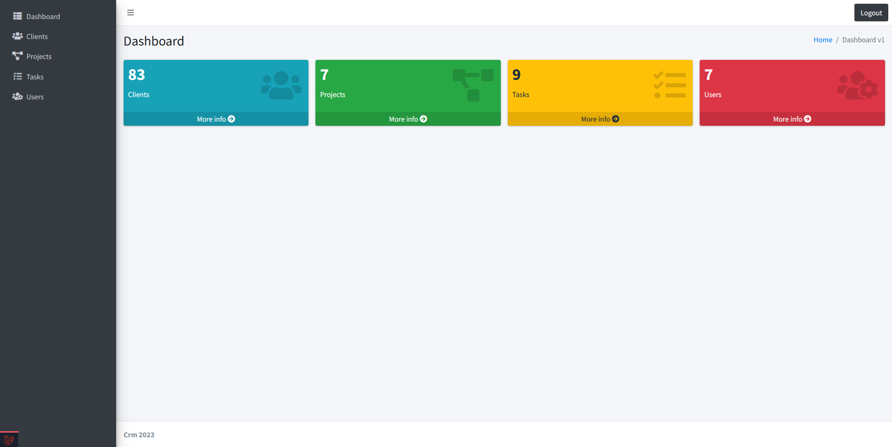
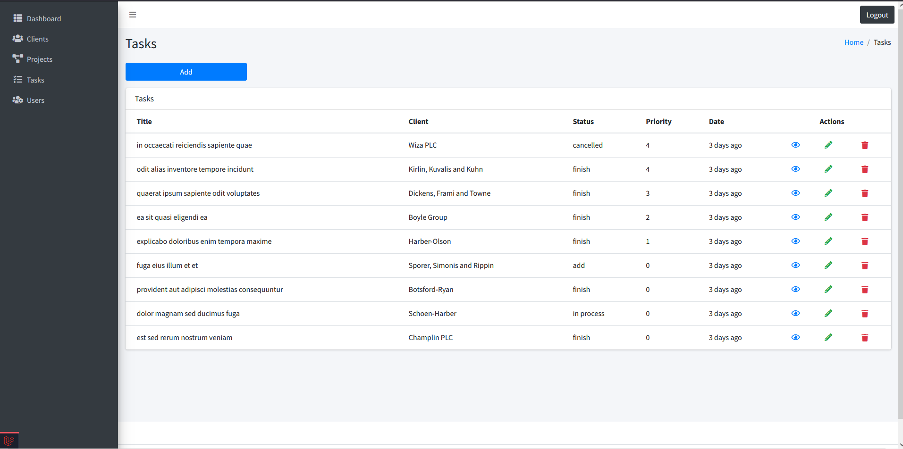
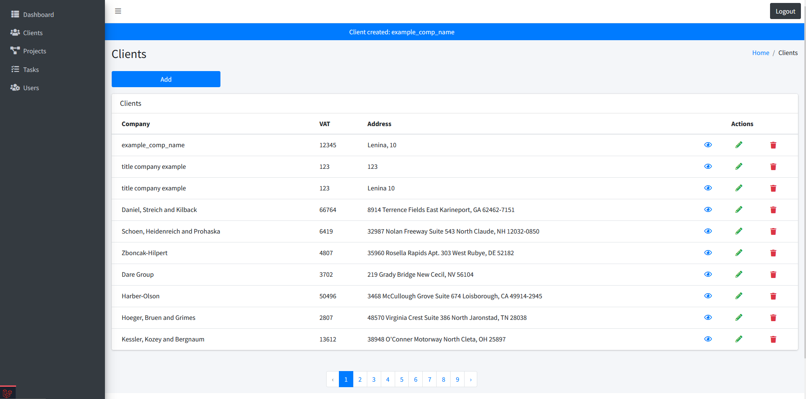
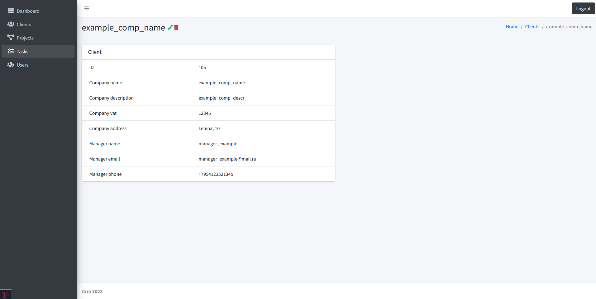
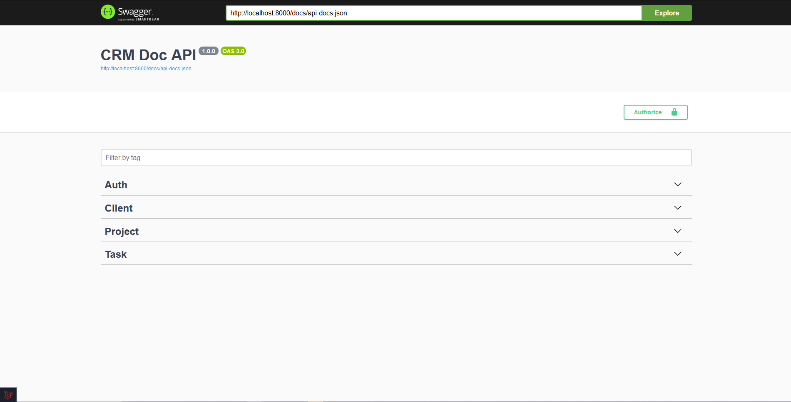
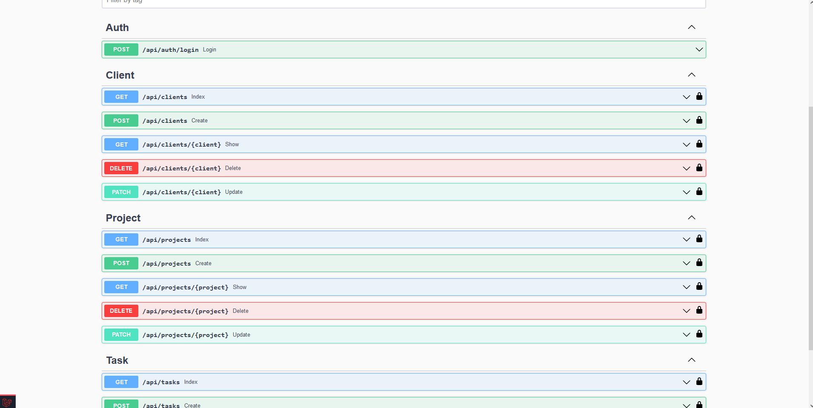
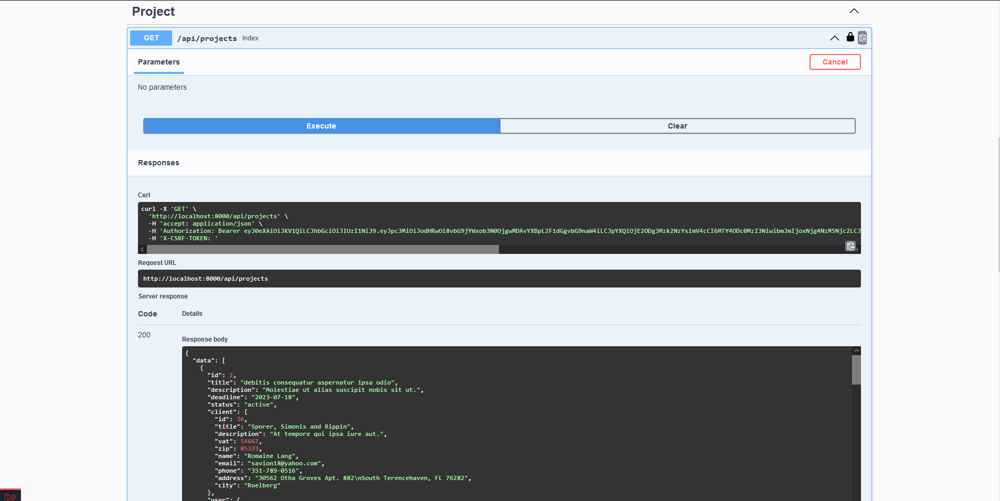
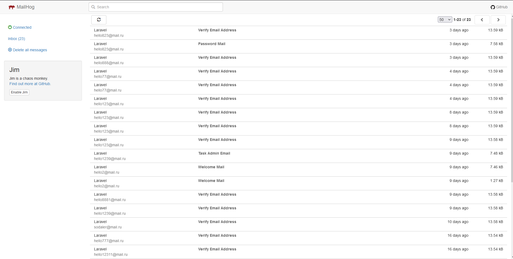

## Advanced Beginner Level
The goal of this level is to find the first job or freelance gig

__Link icons: :book: Official Docs :clapper: Video :page_facing_up: Article :capital_abcd: Course__ 

| Topic                                                                | Examples                                                                                                                                                                                                                                                                                                                                                                                                                                                                                                                                                                                                                                                                                                                                                                               |
|----------------------------------------------------------------------|----------------------------------------------------------------------------------------------------------------------------------------------------------------------------------------------------------------------------------------------------------------------------------------------------------------------------------------------------------------------------------------------------------------------------------------------------------------------------------------------------------------------------------------------------------------------------------------------------------------------------------------------------------------------------------------------------------------------------------------------------------------------------------------|
| **Routing Advanced**                                                 ||
| Route Model Binding                                                  | [web.php](https://github.com/sodaler/Laravel-Roadmap-Advanced-Beginner-Challenge/blob/main/routes/web.php#L29)   [ClientController.php](https://github.com/sodaler/Laravel-Roadmap-Advanced-Beginner-Challenge/blob/main/app/Http/Controllers/Crm/Client/ClientController.php)   [ProjectController.php](https://github.com/sodaler/Laravel-Roadmap-Advanced-Beginner-Challenge/blob/main/app/Http/Controllers/Crm/Project/ProjectController.php)   [TaskController.php](https://github.com/sodaler/Laravel-Roadmap-Advanced-Beginner-Challenge/blob/main/app/Http/Controllers/Crm/Task/TaskController.php)   [UserController.php](https://github.com/sodaler/Laravel-Roadmap-Advanced-Beginner-Challenge/blob/main/app/Http/Controllers/Crm/User/UserController.php)   |
| Route Redirect                                                       | [web.php](https://github.com/sodaler/Laravel-Roadmap-Advanced-Beginner-Challenge/blob/main/routes/web.php#L22)                                                                                                                                                                                                                                                                                                                                                                                                                                                                                                                                                                                                                                                                      |
| **Middleware**                                                       ||
| Create Custom Middleware Class                                       | [AdminMiddleware.php](https://github.com/sodaler/Laravel-Roadmap-Advanced-Beginner-Challenge/blob/main/app/Http/Middleware/AdminMiddleware.php)                                                                                                                                                                                                                                                                                                                                                                                                                                                                                                                                                                                                                                     |
| **Database Advanced**                                                ||
| Database Seeders and Factories                                       | [/seeders](https://github.com/sodaler/Laravel-Roadmap-Advanced-Beginner-Challenge/blob/main/database/seeders/DatabaseSeeder.php)   [/factories](https://github.com/sodaler/Laravel-Roadmap-Advanced-Beginner-Challenge/tree/main/database/factories)                                                                                                                                                                                                                                                                                                                                                                                                                                                                                                                             |
| Eloquent Query Scopes                                                | [User.php](https://github.com/sodaler/Laravel-Roadmap-Advanced-Beginner-Challenge/blob/main/app/Models/User.php#L58)   [Project.php](https://github.com/sodaler/Laravel-Roadmap-Advanced-Beginner-Challenge/blob/main/app/Models/Project.php#L52)    [Task.php](https://github.com/sodaler/Laravel-Roadmap-Advanced-Beginner-Challenge/blob/main/app/Models/Task.php#L48)    [Filterable.php](https://github.com/sodaler/Laravel-Roadmap-Advanced-Beginner-Challenge/blob/main/app/Models/Traits/Filterable.php#L16)                                                                                                                                                                                                                                                       |
| Polymorphic relationships                                            | [Projects_migration](https://github.com/sodaler/Laravel-Roadmap-Advanced-Beginner-Challenge/blob/main/database/migrations/2023_06_25_164506_create_projects_table.php)   [Tasks_migration](https://github.com/sodaler/Laravel-Roadmap-Advanced-Beginner-Challenge/blob/main/database/migrations/2023_06_26_185121_create_tasks_table.php)                                                                                                                                                                                                                                                                                                                                                                                                                                        |
| Eloquent Accessors and Mutators                                      | [Task.php](https://github.com/sodaler/Laravel-Roadmap-Advanced-Beginner-Challenge/blob/main/app/Models/Task.php#L43)                                                                                                                                                                                                                                                                                                                                                                                                                                                                                                                                                                                                                                                                |
| Eloquent Collections                                                 | _Controllers_   _Tests_                                                                                                                                                                                                                                                                                                                                                                                                                                                                                                                                                                                                                                                                                                                                                             |
| Soft Deletes                                                         | [User.php](https://github.com/sodaler/Laravel-Roadmap-Advanced-Beginner-Challenge/blob/main/app/Models/User.php#L18)                                                                                                                                                                                                                                                                                                                                                                                                                                                                                                                                                                                                                                                                   
| **Auth Advanced**                                                    ||
| Authorization: Roles/Permissions, Gates, Policies                    | [UserRoleEnum.php](https://github.com/sodaler/Laravel-Roadmap-Advanced-Beginner-Challenge/blob/main/app/Enums/User/UserRoleEnum.php)   [AdminPolicy.php](https://github.com/sodaler/Laravel-Roadmap-Advanced-Beginner-Challenge/blob/main/app/Policies/AdminPolicy.php)                                                                                                                                                                                                                                                                                                                                                                                                                                                                                                          |
| Authentication: Email Verification                                   | [SendVerifyWithQueueNotification.php](https://github.com/sodaler/Laravel-Roadmap-Advanced-Beginner-Challenge/blob/main/app/Notifications/SendVerifyWithQueueNotification.php)   [User.php](https://github.com/sodaler/Laravel-Roadmap-Advanced-Beginner-Challenge/blob/main/app/Models/User.php#L16)                                                                                                                                                                                                                                                                                                                                                                                                                                                                             |
| **File Uploads Advanced**                                            |                                                                                                                                                                                                                                                                                                                                                                                                                                                                                                                                                                                                                      
| Extra Packages: Spatie Medialibrary, Intervention Image, etc         | [StoreMediaAction.php](https://github.com/sodaler/Laravel-Roadmap-Advanced-Beginner-Challenge/blob/main/app/Actions/Media/StoreMediaAction.php)   [Project.php](https://github.com/sodaler/Laravel-Roadmap-Advanced-Beginner-Challenge/blob/main/app/Models/Project.php#L14)                                                                                                                                                                                                                                                                                                                                                                                                                                                                                                     |
| **API Basics**                                                       |                                                                                                                                                                                                                                                                                                                                                                                                                                                                                                                                                                                                                                                                                                                                                                                        |
| API Routes and Controllers                                           | [API Controllers](https://github.com/sodaler/Laravel-Roadmap-Advanced-Beginner-Challenge/tree/main/app/Http/Controllers/Api/V1)   [api.php](https://github.com/sodaler/Laravel-Roadmap-Advanced-Beginner-Challenge/blob/main/routes/api.php)                                                                                                                                                                                                                                                                                                                                                                                                                                                                                                                                     |
| Working with API Clients: Postman or Alternatives                    | :book: [Postman API Client](https://www.postman.com/product/api-client/)                                                                                                                                                                                                                                                                                                                                                                                                                                                                                                                                                                                                                                                                                                            |
| API Eloquent Resources                                               | [Resources](https://github.com/sodaler/Laravel-Roadmap-Advanced-Beginner-Challenge/tree/main/app/Http/Resources)                                                                                                                                                                                                                                                                                                                                                                                                                                                                                                                                                                                                                                                                    |
| API Auth with JWT                                                    | [api.php](https://github.com/sodaler/Laravel-Roadmap-Advanced-Beginner-Challenge/blob/main/routes/api.php#L26)   [User.php](https://github.com/sodaler/Laravel-Roadmap-Advanced-Beginner-Challenge/blob/main/app/Models/User.php#L16)                                                                                                                                                                                                                                                                                                                                                                                                                                                                                                                                            |
| API Error Handling and Status Codes                                  | [Handler.php](https://github.com/sodaler/Laravel-Roadmap-Advanced-Beginner-Challenge/blob/main/app/Exceptions/Handler.php)                                                                                                                                                                                                                                                                                                                                                                                                                                                                                                                                                                                                                                                          
| **Debugging Errors**                                                 ||
| Log Files in Laravel                                                 | [Handler.php](https://github.com/sodaler/Laravel-Roadmap-Advanced-Beginner-Challenge/blob/main/app/Exceptions/Handler.php#L74)                                                                                                                                                                                                                                                                                                                                                                                                                                                                                                                                                                                                                                                      |
| Try-Catch and Laravel Exceptions                                     | [Handler.php](https://github.com/sodaler/Laravel-Roadmap-Advanced-Beginner-Challenge/blob/main/app/Exceptions/Handler.php)                                                                                                                                                                                                                                                                                                                                                                                                                                                                                                                                                                                                                                                          |
| Local Debugging Tools: Debugbar, Telescope, Ray                      | :book: [barryvdh/laravel-debugbar](https://github.com/barryvdh/laravel-debugbar)  :book: [Laravel Telescope](https://laravel.com/docs/8.x/telescope)                                                                                                                                                                                                                                                                                                                                                                                                                                                                                                                                                                                                                             |
| Customizing Error Pages and Messages                                 | [/mail](https://github.com/sodaler/Laravel-Roadmap-Advanced-Beginner-Challenge/tree/main/resources/views/mail)                                                                                                                                                                                                                                                                                                                                                                                                                                                                                                                                                                                                                                                                      
| (optional) Third Party Bug Trackers: Bugsnag, Flare, Sentry, Rollbar | :book: [Bugsnag Laravel](https://docs.bugsnag.com/platforms/php/laravel/)  :book: [Flare Homepage](https://flareapp.io/)  :book: [Sentry Laravel](https://docs.sentry.io/platforms/php/guides/laravel/)  :book: [Rollbar Laravel](https://docs.rollbar.com/docs/laravel)  :clapper: [Bug Tracking in Laravel: Bugsnag vs Flare [Demo/Review]](https://www.youtube.com/watch?v=88UqUXhWwGA)                                                                                                                                                                                                                                                                                                                                                                              |
| **Sending Email**                                                    ||
| Mailables and Mail Facade                                            | [/Mail](https://github.com/sodaler/Laravel-Roadmap-Advanced-Beginner-Challenge/tree/main/app/Mail)   [/Jobs](https://github.com/sodaler/Laravel-Roadmap-Advanced-Beginner-Challenge/tree/main/app/Jobs)                                                                                                                                                                                                                                                                                                                                                                                                                                                                                                                                                                             |
| Configure Drivers/Services: Mailgun, Mailtrap, etc                   | :book: [MailHog](https://github.com/mailhog/MailHog)                                                                                                                                                                                                                                                                                                                                                                                                                                                                                                                                                                                                                                                                                                                                   |                                                                                                                                                                                                                                                                                                                                                                                                                                                                                  |
| **Automated Testing with PHPUnit**                                   ||
| Configure Testing Database and Test CRUD Operations                  | [/Feature](https://github.com/sodaler/Laravel-Roadmap-Advanced-Beginner-Challenge/tree/main/tests/Feature/Controllers)   [/Unit](https://github.com/sodaler/Laravel-Roadmap-Advanced-Beginner-Challenge/tree/main/tests/Unit)                                                                                                                                                                                                                                                                                                                                                                                                                                                                                                                                        |
| **Deployment and Version Control**                                   ||
| Git Version Control                                                  | :book: [Git](https://git-scm.com/)  :clapper: [Git in Laravel. Part 1 - Branches: Main, Develop and Feature](https://www.youtube.com/watch?v=AmScEC-_72I)                                                                                                                                                                                                                                                                                                                                                                                                                                                                                                                                                                                                                        |
| Deployment on Live Servers                                           | :book: [Deployment](https://laravel.com/docs/8.x/deployment)  :page_facing_up: [How to Deploy Laravel Projects to Live Server: The Ultimate Guide](https://laraveldaily.com/how-to-deploy-laravel-projects-to-live-server-the-ultimate-guide/)  :page_facing_up: [What Server is Needed to Deploy Laravel Projects](https://laraveldaily.com/what-server-is-needed-to-deploy-laravel-projects/)  :clapper: [How we Deploy Laravel: Branches, Staging Servers, Forge and Envoyer](https://www.youtube.com/watch?v=8DVuVftFZcQ)                                                                                                                                                                                                                                              |

---

## This project also includes

- Jobs
- Observers
- Swagger api docs
- Custom flash
- Actions
- Policies
- Requests
- Filter
- Commands

---

## Installation

Setting up your development environment on your local machine :

- git clone https://github.com/sodaler/Laravel-Roadmap-Advanced-Beginner-Challenge.git
- cp .env.example .env
- composer install
- npm install
- crm:install
- php artisan serve
- npm run dev

---

## Screenshots

### CRM

http://localhost:8000/crm

### Swagger

http://localhost:8000/api/documentation

### MailHog

http://localhost:8025/

